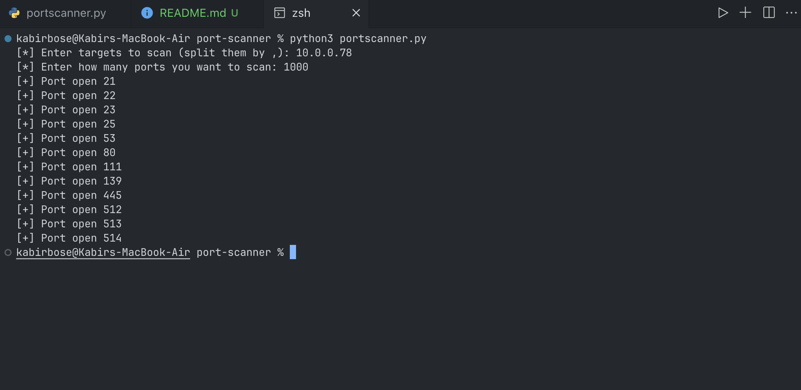

# Port Scanner by Kabir Bose

# Purpose

Similar to Nmap, this is a port-scanner used for reconaissance and finding vulnerabilities on devices that are connected to the internet by checking for open ports.

It uses Python's Socket library to check for open ports over TCP and UDP.

# Setup

1. Run the file using `python3 portscanner.py`
2. Enter one or more IP addresses to scan (eg. `192.168.1.1` or `192.168.1.1,10.0.0.50`)
3. Enter the number of ports you want to scan (eg. `1000`)
4. You can now see your open ports (no output means all ports are closed/filtered)

# Screenshots

### Output of program tested using Metasploitable vulnerable VM

